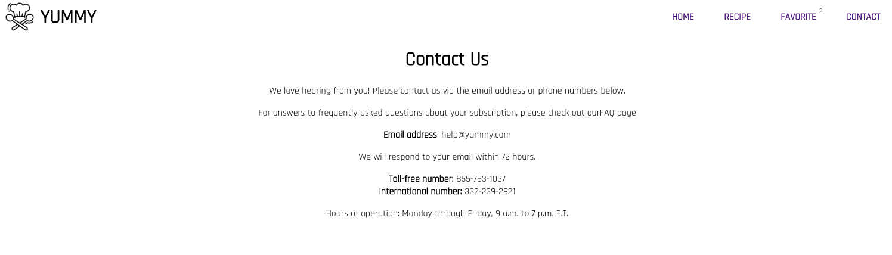

<!-- PROJECT LOGO -->

    

<h3 align="center">Yummy - Your personal recipe app website</h3>
  

    Yummy is a personal project built with TypeScript, React.js, React Router Dom
     
  

<!-- TABLE OF CONTENTS -->

  
Table of Contents

  <ol>
    <li>
      <a href="#about-the-project">About The Project</a>
      <ul>
        <li><a href="#built-with">Built With</a></li>
      </ul>
    </li>
    <li><a href="#functionalities">Functionalities</a></li>
    <li><a href="#author">Author</a></li>
  </ol>

<!-- ABOUT THE PROJECT -->
## About The Project

The objective of this project was to develop from scratch a front-end project, with data fetched from a RESTful API, built with only with the following stack:

### Built With

* [![HTML5][HTML5]][HTML5-url]
* [![CSS3][CSS3]][CSS3-url]
* [![TypeScript][TypeScript]][TypeScript-url]
* [![React][React.js]][React-url]
* [![Material-UI][Material-UI]][Material-UI-url]

(<a href="#readme-top">back to top</a>)

<!-- Functionalities -->
## Functionalities

- [ ] All the data is fetched from a <a href="https://www.themealdb.com/">JSON API</a>
- [ ] The user can search a meal by name
- [ ] The user can add their favorite by clicking the heart icon and the favorite recipes show in Favorite page
- [ ] The user can find more details about a recipe by clicking on the arrow on the recipe element

(<a href="#readme-top">back to top</a>)

<!-- Screenshots -->
## Screenshots

1. Home page
   

2. Recipe page
   

3. Favorite page
   

4. Contact page
   

(<a href="#readme-top">back to top</a>)

<!-- AUTHORS -->
## Authors:
* [Antoine]

(<a href="#readme-top">back to top</a>)

<!-- MARKDOWN LINKS & IMAGES -->
<!-- https://www.markdownguide.org/basic-syntax/#reference-style-links -->

[React.js]: https://img.shields.io/badge/React-20232A?style=for-the-badge&logo=react&logoColor=61DAFB
[React-url]: https://reactjs.org/
[Redux]: https://img.shields.io/badge/Redux-593D88?style=for-the-badge&logo=redux&logoColor=white
[Redux-url]: https://redux-toolkit.js.org/
[TypeScript]: https://img.shields.io/badge/TypeScript-007ACC?style=for-the-badge&logo=typescript&logoColor=white
[TypeScript-url]: https://www.typescriptlang.org/
[HTML5]: https://img.shields.io/badge/HTML5-E34F26?style=for-the-badge&logo=html5&logoColor=white
[HTML5-url]: https://html.spec.whatwg.org/multipage/
[CSS3]: https://img.shields.io/badge/CSS3-1572B6?style=for-the-badge&logo=css3&logoColor=white
[CSS3-url]: https://www.w3.org/Style/CSS/Overview.en.html
[Material-UI]: https://img.shields.io/badge/Material--UI-0081CB?style=for-the-badge&logo=material-ui&logoColor=white
[Material-UI-url]: https://mui.com/
[MongoDB]: https://img.shields.io/badge/MongoDB-4EA94B?style=for-the-badge&logo=mongodb&logoColor=white
[MongoDB-url]: https://www.mongodb.com/
[Express.js]: https://img.shields.io/badge/Express.js-404D59?style=for-the-badge
[Express-url]: https://expressjs.com/
[Node.js]: https://img.shields.io/badge/Node.js-43853D?style=for-the-badge&logo=node.js&logoColor=white
[Node-url]: https://nodejs.org/en

[Antoine]: https://github.com/Ant1ne
